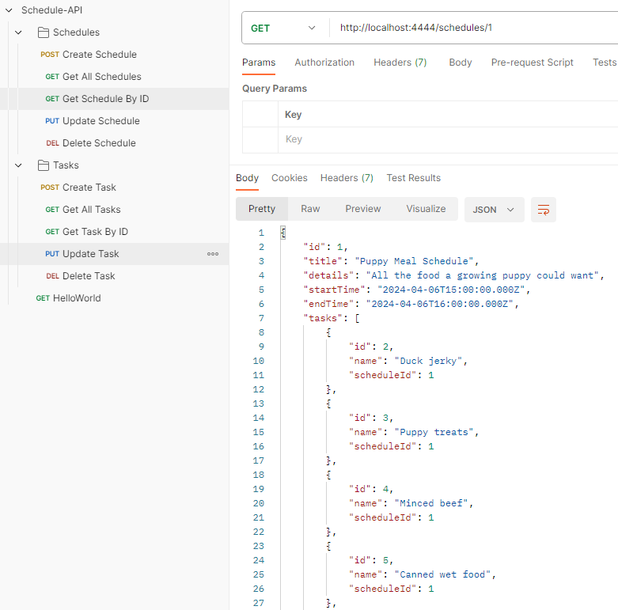

# Schedule and Task Management API

This API is designed for managing schedules and tasks, providing a solid foundation for building a task management system. It utilizes NestJS for the framework, Prisma as the ORM, and PostgreSQL for the database. The API is developed with SOLID principles in mind to ensure maintainable and scalable code.

## Features

- **Schedules Management**: Create, retrieve, update, and delete schedules.
- **Tasks Management**: Create, retrieve, update, and delete tasks associated with schedules.
- **Database Integration**: Uses PostgreSQL for storage, with Prisma ORM for database interactions.
- **Testing**: Includes unit tests for service layers to ensure business logic correctness.

## Getting Started

These instructions will get you a copy of the project up and running on your local machine.

### Prerequisites

- Node.js
- Docker
- PostgreSQL
- Prisma

### Installation

Note: The app can run entirely from docker (with an app container and a postgres container), or it can run with a combination of the docker container(just using the db container) and the app running 'npm run start:dev' locally.  This might be useful for ease of development.

The app runs on port 3333 if running locally for developement, and on port 4444 if deployed through docker, this was done to avoid port conflicts.

1. Clone the repository:
```bash
git clone <repository-url>
```

2. setup a .env file
```
DATABASE_URL="postgresql://<dbusername>:<dbpassword>@localhost:5432/schedule?schema=public"
POSTGRES_USER=<dbusername>
POSTGRES_PASSWORD=<dbpassword>
POSTGRES_DB=schedule
```

3. Start PostgreSQL database:
```bash
docker-compose up -d
```

4. Generate Prisma client for database interactions:
```bash
npx prisma generate
```

5. Run Prisma migrations to set up the database schema:
```bash
npx prisma migrate dev
```

6. Start the application:
```bash
npm run start:dev
```

7. Testing
Unit tests are available for service layers, ensuring business logic is correctly implemented:

Run unit tests:
```bash
npm test
```

Run specific test files (e.g., for task service):
```bash
npm test -- test/task.service.spec.ts
```

Proof of concept E2E test included. 
Note: this is a basic test that only injects a schedule into the database, however, at this stage no attempt is made to to make it Idempotent, although this should be managed moving forward
```bash
npx jest --config jest.e2e.config.js
```

### API Endpoints
The API provides endpoints for managing schedules and tasks:

Schedules:
Create a schedule: POST /schedules
* Get all schedules: GET /schedules
* Get schedule by ID: GET /schedules/:id
* Update a schedule: PUT /schedules/:id
* Delete a schedule: DELETE /schedules/:id

Tasks:
Create a task: POST /tasks
* Get all tasks: GET /tasks
* Get task by ID: GET /tasks/:id
* Update a task: PUT /tasks/:id
* Delete a task: DELETE /tasks/:id

### Schedule API in postman example


